```{=html}
<style>
  @import url('https://fonts.googleapis.com/css2?family=Roboto&family=Open+Sans&display=swap');

  body {
  font-family: 'Roboto', sans-serif;
}

h1, h2, h3, h4, h5, h6 {
  font-family: 'Open Sans', sans-serif;
}

h1 { font-size: 1.6rem !important; }
h2 { font-size: 1.2rem !important; }
h3 { font-size: 1.1rem !important; }
h4 { font-size: 1.0rem !important; }
  
.indented-list {
  padding-left: 20px;
  font-size: 90%;
}

.crop-bottom-half {
  width: 100%;
  max-width: 100%;
  height: 300px; /* half of image height or desired height */
  overflow: hidden;
  position: relative;
  margin: 20px auto;
  border-radius: 8px;
}

.crop-bottom-half img {
  position: absolute;
  bottom: 0;
  left: 0;
  width: 100%;
  height: auto;
  object-fit: cover;
}

.crop-bottom-half .image-text {
  position: absolute;
  bottom: 0;    
  left: 0;
  width: 100%;         
  background-color: rgba(0, 0, 0, 0.3);
  color: white;  
  font-family: Georgia, serif;
  font-style: italic;
  font-size: 1.2rem;
  font-weight: normal;
  text-align: center;
  padding: 10px 50px;
  box-sizing: border-box;
}

.crop-bottom-half .quote {
  font-family: Georgia, serif;
  font-style: italic;
  font-size: 1.4rem;
  line-height: 1.4;
  display: block;
}

.crop-bottom-half .attribution {
  font-family: "Roboto", sans-serif;
  font-size: 0.9rem;
  font-style: normal;
  font-weight: 300;
  margin-top: 6px;
  display: block;
}

blockquote {
  font-family: Garamond, serif !important;
  font-size: 1.4rem !important;
  font-style: italic !important;
  border-left: 4px solid #1C2944 !important;
  padding-left: 1em !important;
  margin-left: 2em !important;
  color: #444 !important;
  line-height: 1.25 !important;
}

.circle-pair {
  text-align: center; 
  margin: 2em 0;
}

.circle-pair .circle {
  display: inline-block;
  width: 300px;
  height: 300px;
  margin: 0 15px;
  border-radius: 50%;
  overflow: hidden;
  vertical-align: top;
  box-shadow: 0 4px 10px rgba(0,0,0,0.1);
}

.circle-pair .circle img {
  width: 100%;
  height: 100%;
  object-fit: cover;
  display: block;
}

.section-summary {
  background-color: #1C2944;
  color: white;
  border-radius: 10px;
  padding: 1.5em 2em;
  margin: 2em 0;
}

.section-summary h3 {
  color: white !important;
  margin-top: 0;
  font-size: 1rem !important;
  letter-spacing: 0.08em;
  text-transform: uppercase;
}

.section-summary li {
  margin-bottom: 0.5em;
  line-height: 1.5;
}

.home-btn {
  display: inline-block;
  font-family: 'Open Sans', sans-serif;
  font-size: 0.7rem;
  font-weight: 700;
  letter-spacing: 0.08em;
  text-transform: uppercase;
  color: white;
  text-decoration: none;
  background-color: #1C2944;
  border: 2px solid #1C2944;
  border-radius: 20px;
  padding: 4px 12px;
  margin-bottom: 0.5em;
  transition: all 0.2s ease;
  display: inline-block;
}

.home-btn:hover {
  background-color: white;
  color: #1C2944;
}
</style>
```

```{=html}
<div style="border-bottom: 3px solid #243559; padding-bottom: 0.5em; margin-bottom: 1em;">
  <a class="home-btn" href="../index.html">← Module Library Home</a>
</div>
```

# **Pre-Module Self-Reflection**

Before you get started with the module content, take a few minutes to consider your answers to the questions below.

```{=html}
<div style="display: flex; gap: 1.2em; margin-bottom: 1.5em; align-items: flex-start;">
  <div style="min-width: 32px; height: 32px; background: #1C2944; border-radius: 50%; display: flex; align-items: center; justify-content: center; color: white; font-weight: 700; font-size: 0.95rem;">1</div>
  <p style="margin: 0; line-height: 1.7;">How do you self-identify? What communities are you a part of?</p>
</div>

<div style="display: flex; gap: 1.2em; margin-bottom: 1.5em; align-items: flex-start;">
  <div style="min-width: 32px; height: 32px; background: #1C2944; border-radius: 50%; display: flex; align-items: center; justify-content: center; color: white; font-weight: 700; font-size: 0.95rem;">2</div>
  <p style="margin: 0; line-height: 1.7;">Think of an experience where you felt conscious of your own race, class, gender, migration status, disability, sexual identity, or other aspects of your identity. </p>
  </div>
  
  <div style="display: flex; gap: 1.2em; margin-bottom: 1.5em; align-items: flex-start;">
  <div style="min-width: 32px; height: 32px; background: #1C2944; border-radius: 50%; display: flex; align-items: center; justify-content: center; color: white; font-weight: 700; font-size: 0.95rem;">3</div>
  <p style="margin: 0; line-height: 1.7;">How do your identities affect the role that you have in group settings or in personal relationships?</p>
  </div>
  
  <div style="display: flex; gap: 1.2em; margin-bottom: 1.5em; align-items: flex-start;">
  <div style="min-width: 32px; height: 32px; background: #1C2944; border-radius: 50%; display: flex; align-items: center; justify-content: center; color: white; font-weight: 700; font-size: 0.95rem;">4</div>
  <p style="margin: 0; line-height: 1.7;">Do you consider yourself to be a privileged person? Why or why not?</p>
  </div>
```

------------------------------------------------------------------------

# **1. Defining Important Terms in Intersectionality**

## **1.1 Defining and acknowledging Privilege**

**Privilege** is defined as “a special right, advantage, or immunity granted or available only to a particular person or group”. After watching the video below, reflect on your own privilege - think back to the questions asked at the start of the module. Have your answers changed?



## **1.2 What is Intersectionality?**

The term intersectionality was first coined by Kimberlé Crenshaw in 1989, defined as "a lens through which you can see where power comes and collides, where it interlocks and intersects.”

The concept of intersectionality refers to the interconnected relationships between a variety of aspects of identity, including (but not limited to) race, class, (dis)ability, sexual orientation, and/or gender on an individual or group level. In the context of mental health, an intersectional lens provides a unique perspective into the “overlapping and interdependent systems of discrimination or disadvantage”.

```{=html}

<div class="crop-bottom-half">

  <div class="image-text">
    <span class="quote">"Intersectionality is a lens through which you can see where power comes and collides, where it interlocks and intersects" <i>- Kimberlé Crenshaw 1989</i></span>
  </div>
</div>
```

## **1.3 Intersectional Stigma**

Intersectional stigma is a concept whereby individuals who identify with multiple marginalized groups (i.e., groups and communities that experience discrimination and exclusion) experience joint effects on their health and overall well-being ([Turan et al. 2019](https://pubmed.ncbi.nlm.nih.gov/30764816/)). The diversity of peoples' experiences are brought to light with the recognition of intersectionality in mental illness and stigma.

There are many intersecting factors that can impact your mental health, including those shown in the flip cards below.

```{=html}
<style>
  .fc-wrap { display: flex; gap: 1.2em; flex-wrap: wrap; justify-content: center; max-width: 760px; margin: 0 auto; padding: 1rem 0; font-family: 'Open Sans', sans-serif; }
  .fc-card { width: 220px; height: 220px; perspective: 1000px; cursor: pointer; }
  .fc-inner { position: relative; width: 100%; height: 100%; transform-style: preserve-3d; transition: transform 0.55s ease; border-radius: 12px; }
  .fc-card.flipped .fc-inner { transform: rotateY(180deg); }
  .fc-front, .fc-back { position: absolute; width: 100%; height: 100%; backface-visibility: hidden; border-radius: 12px; overflow: hidden; }
  .fc-front { background: #1C2944; }
  .fc-front img { width: 100%; height: 100%; object-fit: cover; display: block; }
  .fc-back { background: #f0f2f5; border: 2px solid #1C2944; transform: rotateY(180deg); display: flex; flex-direction: column; justify-content: flex-start; padding: 1.2em; box-sizing: border-box; overflow-y: auto;}
  .fc-back-title { font-size: 0.78rem; font-weight: 700; color: #1C2944; margin: 0 0 0.5em 0; text-transform: uppercase; letter-spacing: 0.05em;}
  .fc-back-body { font-size: 0.78rem; line-height: 1.6; color: #444; margin: 0; }
  .fc-hint { text-align: center; font-size: 0.7rem; color: #aaa; margin-top: 0.4em; }
</style>

<div class="fc-wrap">

  <div>
    <div class="fc-card" onclick="this.classList.toggle('flipped')">
      <div class="fc-inner">
        <div class="fc-front">
          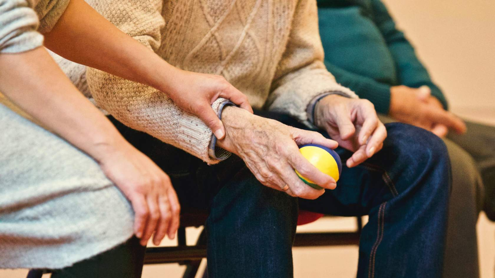
        </div>
        <div class="fc-back" style="align-items: center; justify-content: center;">
      <p class="fc-back-title" style="font-size: 1.2rem; text-align: center;">AGE</p>
      </div>
      </div>
    </div>
    <p class="fc-hint">click to flip</p>
  </div>

  <div>
    <div class="fc-card" onclick="this.classList.toggle('flipped')">
      <div class="fc-inner">
        <div class="fc-front">
          
        </div>
        <div class="fc-back" style="align-items: center; justify-content: center;">
      <p class="fc-back-title" style="font-size: 1.2rem; text-align: center;">SEXUAL ORIENTATION</p>
      </div>
      </div>
    </div>
    <p class="fc-hint">click to flip</p>
  </div>

  <div>
    <div class="fc-card" onclick="this.classList.toggle('flipped')">
      <div class="fc-inner">
        <div class="fc-front">
          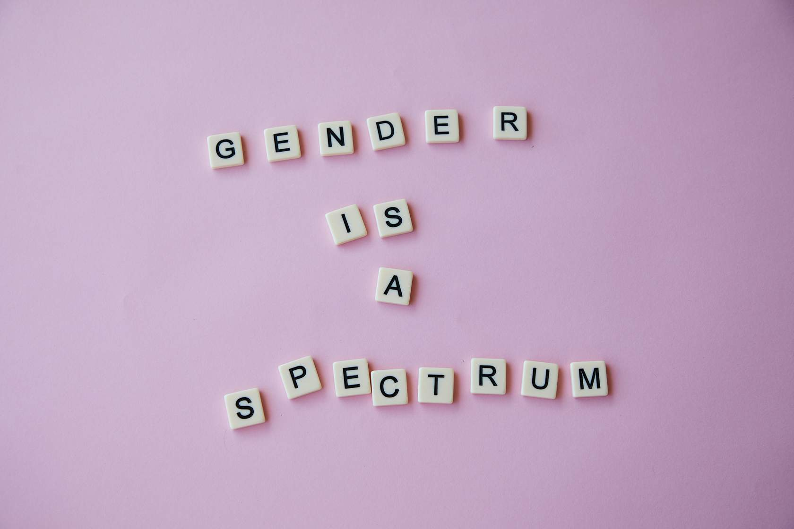
        </div>
        <div class="fc-back" style="align-items: center; justify-content: center;">
      <p class="fc-back-title" style="font-size: 1.2rem; text-align: center;">GENDER IDENTITY</p>
      </div>
      </div>
    </div>
    <p class="fc-hint">click to flip</p>
  </div>

  <div>
    <div class="fc-card" onclick="this.classList.toggle('flipped')">
      <div class="fc-inner">
        <div class="fc-front">
          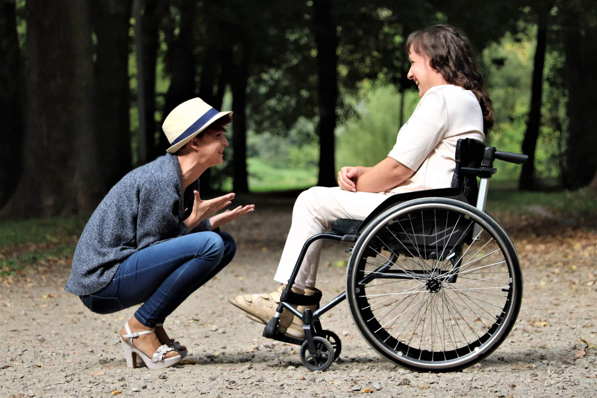
        </div>
        <div class="fc-back" style="align-items: center; justify-content: center;">
      <p class="fc-back-title" style="font-size: 1.2rem; text-align: center;">DISABILITY STATUS</p>
      </div>
      </div>
    </div>
    <p class="fc-hint">click to flip</p>
  </div>
  
   <div>
    <div class="fc-card" onclick="this.classList.toggle('flipped')">
      <div class="fc-inner">
        <div class="fc-front">
          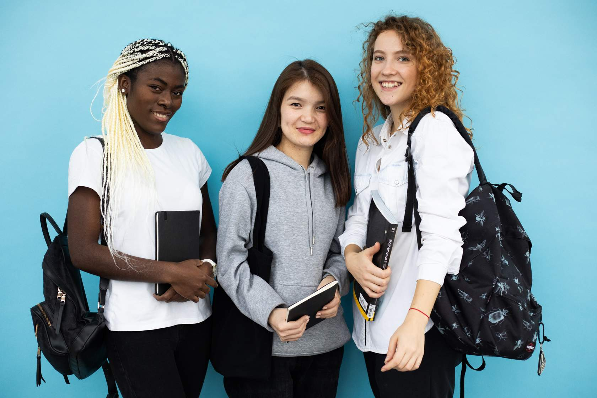
        </div>
        <div class="fc-back" style="align-items: center; justify-content: center;">
      <p class="fc-back-title" style="font-size: 1.2rem; text-align: center;">RACE/ETHNICITY</p>
      </div>
      </div>
    </div>
    <p class="fc-hint">click to flip</p>
  </div>

 <div>
    <div class="fc-card" onclick="this.classList.toggle('flipped')">
      <div class="fc-inner">
        <div class="fc-front">
          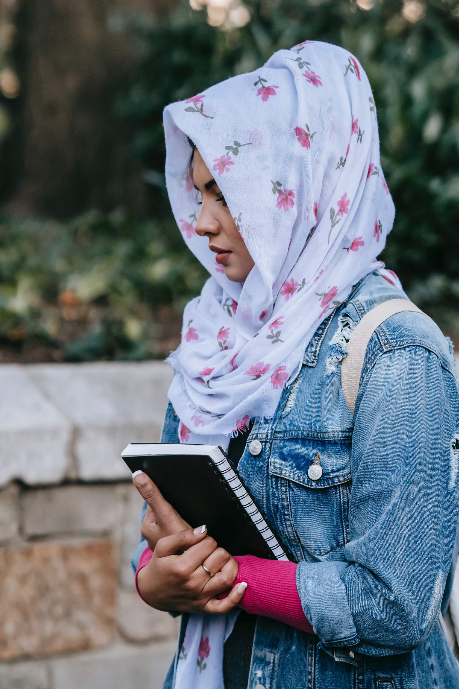
        </div>
        <div class="fc-back" style="align-items: center; justify-content: center;">
      <p class="fc-back-title" style="font-size: 1.2rem; text-align: center;">RELIGION</p>
      </div>
      </div>
    </div>
    <p class="fc-hint">click to flip</p>
  </div>

</div>
```

## **1.4 Equality vs. Equity**

Equality means that everyone is given the same resources or opportunities, while equity recognizes that each person has different circumstances, and allocated the exact resources and opportunities needed to reach an equal outcome. Put differently, equality is about equal shares, while equity is about fair shares.



```{=html}
<div class="section-summary">
  <h3>1.5 Section Summary</h3>
  <p>In this section, we defined key terms that we will come back to again and again: privilege, intersectionality, equity and equality. In the next section, you'll be introduced to the main marginalized groups and communities that we will focus on throughout the remainder of this module.</p>
</div>
```

------------------------------------------------------------------------

# **2. Marginalized Communities**

Marginalized populations are communities that experience discrimination and exclusion due to unequal power distributions socially, economically, and politically. There are many types of marginalized communities, including, but not limited to members of the disabled community, racial and cultural minority communities, and LGBTQ+ communities.

## **2.1 Disability Status**

The CDC defines disability as “any condition of the body or mind (impairment) that makes it more difficult for the person with the condition to do certain activities (activity limitation) and interact with the world around them (participation restrictions)” ([Centers for Disease Control, 2020](https://www.cdc.gov/disability-and-health/about/?CDC_AAref_Val=https://www.cdc.gov/ncbddd/disabilityandhealth/disability.html)).

Disabilities can range from those related to vision, movement, thinking, remembering, learning, communicating, hearing, mental health, and social relationships. The term “person living with a disability” (PLD) is often used as an overarching term for individuals with disabilities, however the experiences of individuals who share the same disability can be very different.

**Who is affected by disability?**

- 1.1 billion people globally live with a disability ([WHO, 2011](https://www.who.int/teams/noncommunicable-diseases/sensory-functions-disability-and-rehabilitation/world-report-on-disability))
- In Canada, 1 in 5 individuals aged 15 years or older identify as living with a disability ([Statistics Canada, 2018](https://www150.statcan.gc.ca/n1/pub/89-654-x/89-654-x2018002-eng.htm))

::: callout-note
As you may have learned in our introductory module, living with a well-managed mental illness is not an inherently "bad" thing. Similarly, living with a disability is not "bad" - in fact, a common myth is that individuals living with a disability wish that they weren't. Watch Dylan Alcott debunk this myth in his video below, and learn more about his lived experience growing up disabled.
:::



```{=html}
<div style="display: flex; align-items: center; justify-content: space-between; gap: 2em; padding: 1.2em 1.5em; border-radius: 8px; background: white; border: 1px solid #eee; margin-bottom: 1em;">
  <div>
    <p style="font-weight: 700; margin: 0 0 0.3em 0; color: #1C2944;">World Report on Disability</p>
    <p style="margin: 0; font-size: 0.9rem; color: #444; line-height: 1.5;">Learn more about disability worldwide in the World Health Organization's World Report on Disability (2011).</p>
  </div>
  <a href="https://www.who.int/teams/noncommunicable-diseases/sensory-functions-disability-and-rehabilitation/world-report-on-disability" target="_blank" style="flex-shrink: 0; background: #1C2944; color: white; font-weight: 700; font-size: 0.8rem; letter-spacing: 0.1em; text-transform: uppercase; padding: 14px 24px; border-radius: 30px; text-decoration: none; white-space: nowrap;">Learn More</a>
</div>
<br>
```

**Disability and Mental Health**

So how does disability effect mental health? Persons living with a disability (PLD) experience negative impacts on their mental health through the impacts of accessibility, ableism, and stigma. Flip the cards to see each of these terms defined.

```{=html}
<style>
  .fc-wrap { display: flex; gap: 1.2em; flex-wrap: wrap; justify-content: center; max-width: 760px; margin: 0 auto; padding: 1rem 0; font-family: 'Open Sans', sans-serif; }
  .fc-card { width: 220px; height: 220px; perspective: 1000px; cursor: pointer; }
  .fc-inner { position: relative; width: 100%; height: 100%; transform-style: preserve-3d; transition: transform 0.55s ease; border-radius: 12px; }
  .fc-card.flipped .fc-inner { transform: rotateY(180deg); }
  .fc-front, .fc-back { position: absolute; width: 100%; height: 100%; backface-visibility: hidden; border-radius: 12px; overflow: hidden; }
  .fc-front { background: #1C2944; }
  .fc-front img { width: 100%; height: 70%; object-fit: cover; display: block; }
  .fc-front-label { color: white; font-size: 0.78rem; font-weight: 700; letter-spacing: 0.06em; text-transform: uppercase; padding: 0.8em 1em; text-align: center; }
  .fc-back { background: #f0f2f5; border: 2px solid #1C2944; transform: rotateY(180deg); display: flex; flex-direction: column; justify-content: flex-start; padding: 1.2em; box-sizing: border-box; overflow-y: auto;}
  .fc-back-title { font-size: 0.78rem; font-weight: 700; color: #1C2944; margin: 0 0 0.5em 0; text-transform: uppercase; letter-spacing: 0.05em;}
  .fc-back-body { font-size: 0.78rem; line-height: 1.6; color: #444; margin: 0; }
  .fc-hint { text-align: center; font-size: 0.7rem; color: #aaa; margin-top: 0.4em; }
</style>

<div class="fc-wrap">

  <div>
    <div class="fc-card" onclick="this.classList.toggle('flipped')">
      <div class="fc-inner">
        <div class="fc-front">
          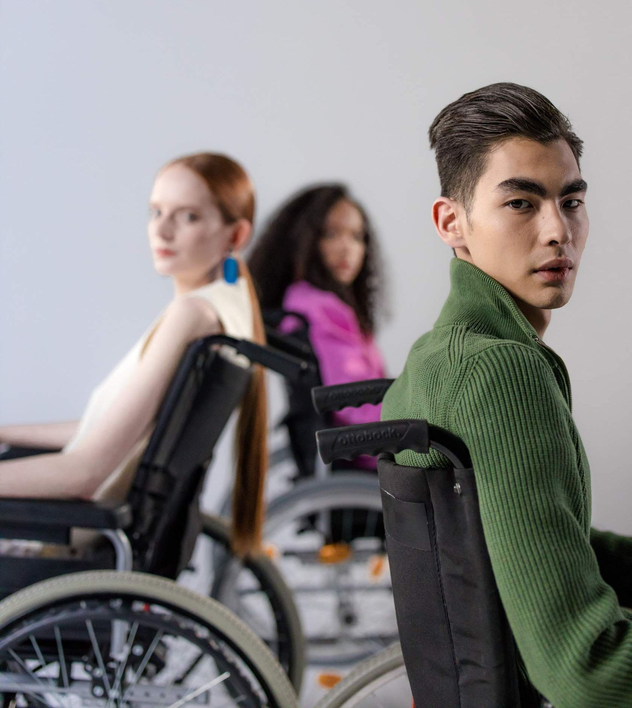
          <div class="fc-front-label">Accessibility</div>
        </div>
        <div class="fc-back">
          <p class="fc-back-title">Accessibility</p>
          <p class="fc-back-body">Accessibility is met when the needs of people living with disabilities are specifically considered, and products, services, and facilities are built or modified for equal use.</p>
        </div>
      </div>
    </div>
    <p class="fc-hint">click to flip</p>
  </div>

  <div>
    <div class="fc-card" onclick="this.classList.toggle('flipped')">
      <div class="fc-inner">
        <div class="fc-front">
          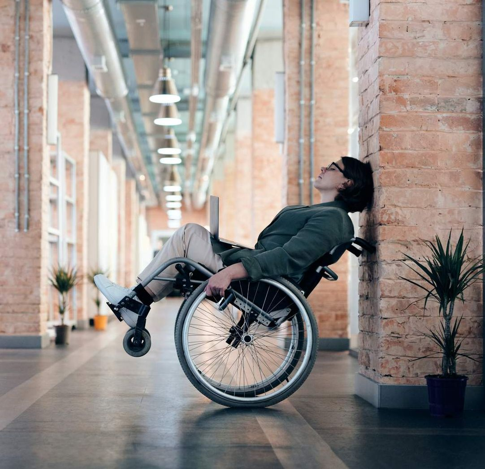
          <div class="fc-front-label">Ableism</div>
        </div>
        <div class="fc-back">
          <p class="fc-back-title">Ableism</p>
          <p class="fc-back-body">Discrimination and social prejudice against people living with disabilities and/or people who are perceived to be living with a disability.</p>
        </div>
      </div>
    </div>
    <p class="fc-hint">click to flip</p>
  </div>

  <div>
    <div class="fc-card" onclick="this.classList.toggle('flipped')">
      <div class="fc-inner">
        <div class="fc-front">
          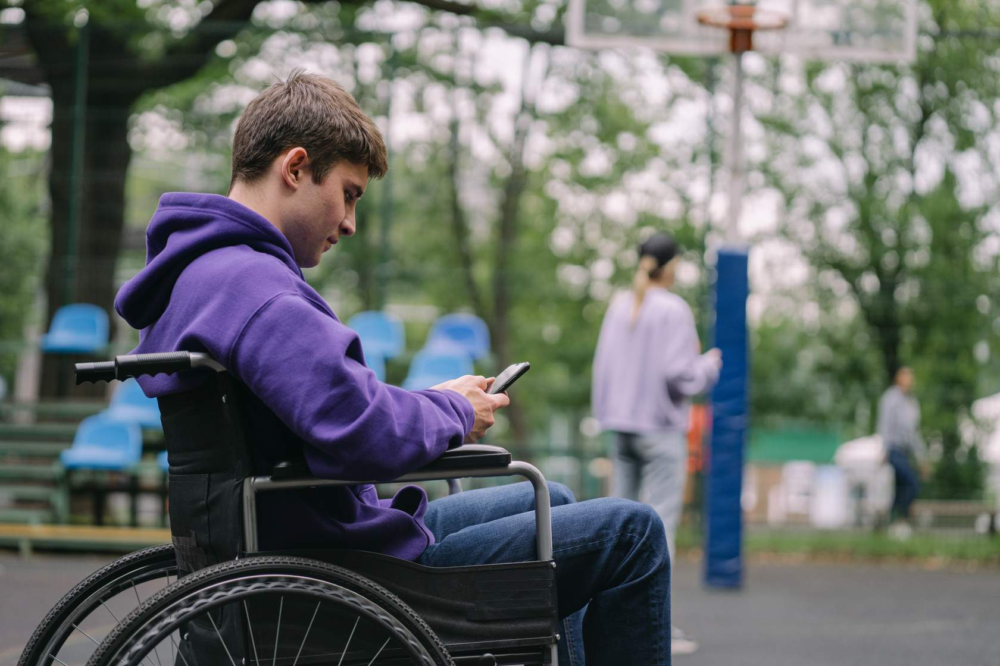
          <div class="fc-front-label">Stigma</div>
        </div>
        <div class="fc-back">
          <p class="fc-back-title">Stigma</p>
          <p class="fc-back-body">Stigma is discrimination and/or prejudice against an individual or group based on perceivable social characteristics that somehow distinguish them from other members of a group. In the context of disability, stigma is often the result of false assumptions (i.e., people living with disabilities are unable to learn).</p>
        </div>
      </div>
    </div>
    <p class="fc-hint">click to flip</p>
  </div>
</div>
```

## **2.2 BIPOC Communities**

BIPOC refers to Black, Indigenous, and People of Color. The term BIPOC was created to bring attention to the marginalization of Black and Indigenous populations and to undo Indigenous invisibility, anti-Blackness, dismantle white supremacy, and advance racial justice.

Canada is home to a diverse population - more than 200 ethnic origins were reported in the ([2011 National household Survey (NHS)](https://www12.statcan.gc.ca/nhs-enm/2011/dp-pd/prof/index.cfm?Lang=E)).

- On the 2016 census, 22% of Canadians identified as belonging to a visible minority, representing about 1 in 5 Canadians. The three largest visible minority groups were South Asian, Chinese and Black.
- Canada is also home to a number of Indigenous communities, including: First Nations, Métis, and Inuit. We will expand more on the unique experiences of Indigenous communities below.

```{=html}
<div style="display: flex; align-items: center; justify-content: space-between; gap: 2em; padding: 1.2em 1.5em; border-radius: 8px; background: white; border: 1px solid #eee; margin-bottom: 1em;">
  <div>
    <p style="font-weight: 700; margin: 0 0 0.3em 0; color: #1C2944;">Immigration and Ethnocultural Diversity</p>
    <p style="margin: 0; font-size: 0.9rem; color: #444; line-height: 1.5;">Learn more about diversity in Canada by checking out Statistics Canada's Immigration and Ethnocultural Diversity Statistics page for a deeper dive into key indicators and a more detailed breakdown.</p>
  </div>
  <a href="https://www.statcan.gc.ca/en/subjects-start/immigration_and_ethnocultural_diversity" target="_blank" style="flex-shrink: 0; background: #1C2944; color: white; font-weight: 700; font-size: 0.8rem; letter-spacing: 0.1em; text-transform: uppercase; padding: 14px 24px; border-radius: 30px; text-decoration: none; white-space: nowrap;">Learn More</a>
</div>
```

**BIPOC Communities and Mental Health**

Members of BIPOC communities experience negative impacts on their mental health through the impacts of marginalization, racism, and microaggressions. Flip the cards to see each of these terms defined. For a deeper dive into race-related stressors and their mental health impacts, we recommend checking out ([this article](https://pmc.ncbi.nlm.nih.gov/articles/PMC6532404/)).

```{=html}
<style>
  .fc-wrap { display: flex; gap: 1.2em; flex-wrap: wrap; justify-content: center; max-width: 760px; margin: 0 auto; padding: 1rem 0; font-family: 'Open Sans', sans-serif; }
  .fc-card { width: 220px; height: 220px; perspective: 1000px; cursor: pointer; }
  .fc-inner { position: relative; width: 100%; height: 100%; transform-style: preserve-3d; transition: transform 0.55s ease; border-radius: 12px; }
  .fc-card.flipped .fc-inner { transform: rotateY(180deg); }
  .fc-front, .fc-back { position: absolute; width: 100%; height: 100%; backface-visibility: hidden; border-radius: 12px; overflow: hidden; }
  .fc-front { background: #1C2944; }
  .fc-front img { width: 100%; height: 70%; object-fit: cover; display: block; }
  .fc-front-label { color: white; font-size: 0.78rem; font-weight: 700; letter-spacing: 0.06em; text-transform: uppercase; padding: 0.8em 1em; text-align: center; }
  .fc-back { background: #f0f2f5; border: 2px solid #1C2944; transform: rotateY(180deg); display: flex; flex-direction: column; justify-content: flex-start; padding: 1.2em; box-sizing: border-box; overflow-y: auto;}
  .fc-back-title { font-size: 0.78rem; font-weight: 700; color: #1C2944; margin: 0 0 0.5em 0; text-transform: uppercase; letter-spacing: 0.05em;}
  .fc-back-body { font-size: 0.78rem; line-height: 1.6; color: #444; margin: 0; }
  .fc-hint { text-align: center; font-size: 0.7rem; color: #aaa; margin-top: 0.4em; }
</style>

<div class="fc-wrap">

  <div>
    <div class="fc-card" onclick="this.classList.toggle('flipped')">
      <div class="fc-inner">
        <div class="fc-front">
          
          <div class="fc-front-label">Marginalization</div>
        </div>
        <div class="fc-back">
          <p class="fc-back-title">Marginalization</p>
          <p class="fc-back-body">A social process by which individuals or groups are distanced from access to power and resources [and] constructed as insignificant, peripheral, or less valuable/privileged to a community or mainstream society.</p>
        </div>
      </div>
    </div>
    <p class="fc-hint">click to flip</p>
  </div>

  <div>
    <div class="fc-card" onclick="this.classList.toggle('flipped')">
      <div class="fc-inner">
        <div class="fc-front">
          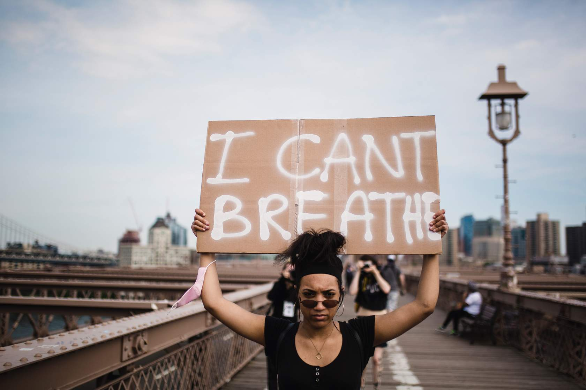
          <div class="fc-front-label">Racism</div>
        </div>
        <div class="fc-back">
          <p class="fc-back-title">Racism</p>
          <p class="fc-back-body">Marginalization and/or oppression of people of colour based on a socially constructed racial hierarchy that privileges white people.</p>
        </div>
      </div>
    </div>
    <p class="fc-hint">click to flip</p>
  </div>

  <div>
    <div class="fc-card" onclick="this.classList.toggle('flipped')">
      <div class="fc-inner">
        <div class="fc-front">
          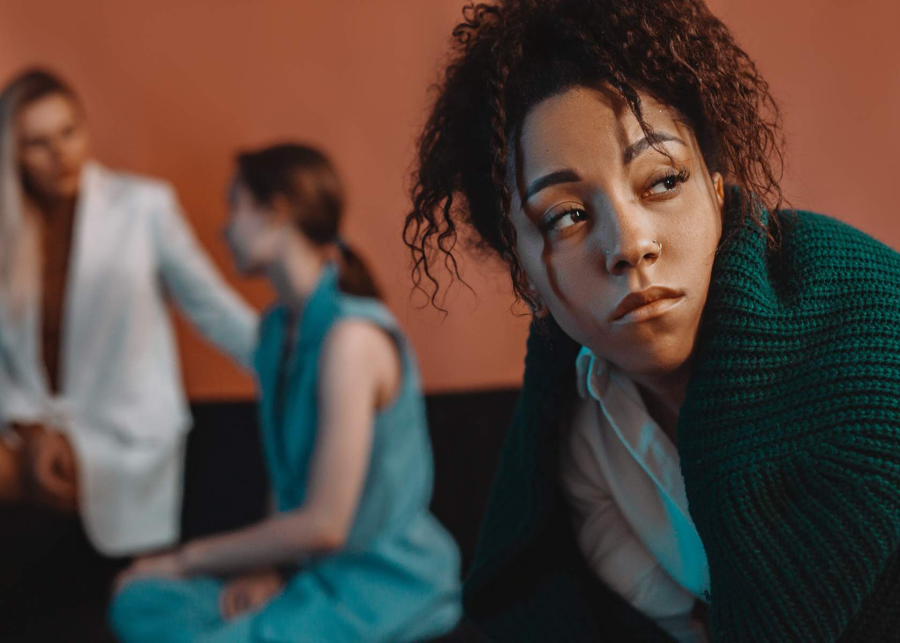
          <div class="fc-front-label">Microaggressions</div>
        </div>
        <div class="fc-back">
          <p class="fc-back-title">Microaggressions</p>
          <p class="fc-back-body">Verbal, behavioural or environmental indignities, slights, put-downs and insults (intentional or unintentional) experienced by marginalized people that can cause ongoing stress and trauma.</p>
        </div>
      </div>
    </div>
    <p class="fc-hint">click to flip</p>
  </div>

</div>
```

## **2.3 Indigenous Communities**

In North America, Indigenous peoples is a collective term used to refer to the original inhabitants of these lands and their descents. The Canadian Constitution recognizes three groups of Indigenous peoples: First Nations, Metis, and Inuit. These distinct groups have unique histories, languages, cultural practices and beliefs.

- 1.67 million people in Canada identify as Indigenous (2016 Census)
- The Indigenous community is rapidly growing in Canada, and 44% are under the age of 25 (2016 Census)

```{=html}

<div class="crop-bottom-half">
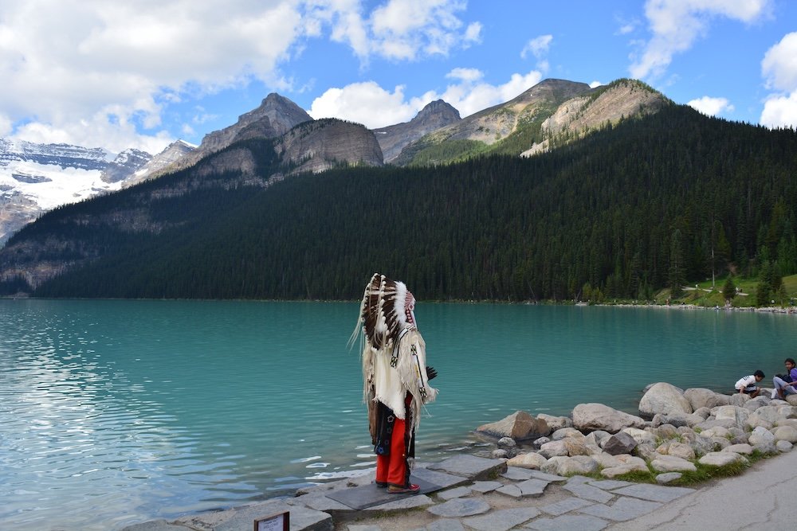
  <div class="image-text">
    <span class="quote">As settlers, it is our responsibility to acknowledge the traditional lands upon which we are currently situated. To learn about whose land you are on, visit https://native-land.ca/ </span>
  </div>
</div>
```

**Indigenous Communities and Mental Health**

Members of Indigenous communities experience negative impacts on their mental health through the impacts of colonialism, intergenerational trauma, and positionality in addition to those barriers faced by members of BIPOC communities. Flip the cards to see each of these new terms defined.

```{=html}
<table style="width: 100%; border-collapse: collapse; font-family: 'Open Sans', sans-serif; font-size: 0.9rem; margin: 1.5em 0;">
  <tbody>
    <tr style="border-bottom: 1px solid #dde3ec;">
    <td style="width: 30%; padding: 1em 1.2em; font-weight: 700; color: white; background: #1C2944; vertical-align: top;">Colonialism</td>
      <td style="padding: 1em 1.2em; color: #444; line-height: 1.7; vertical-align: top;">A practice of domination where a political power from one territory exerts control over another territory through unequal power, economic exploitation, and an occupation of the territory with settlers.</td>
    </tr>
    <tr style="border-bottom: 1px solid #dde3ec;">
      <td style="width: 30%; padding: 1em 1.2em; font-weight: 700; color: white; background: #1C2944; vertical-align: top;">Intergenerational Trauma</td>
      <td style="padding: 1em 1.2em; color: #444; line-height: 1.7; vertical-align: top;">Oppressive or traumatic effects of historic event(s) that is passed down to the next generation.</td>
    </tr>
    <tr>
     <td style="width: 30%; padding: 1em 1.2em; font-weight: 700; color: white; background: #1C2944; vertical-align: top;">Positionality</td>
      <td style="padding: 1em 1.2em; color: #444; line-height: 1.7; vertical-align: top;">Refers to how differences in power and privilege influence identities and access in society.</td>
    </tr>
  </tbody>
</table>
```

## **2.4 2SLGBTQIA+ Communities**

The term 2SLGBTQIA+ is an acronym for two-spirit, lesbian, gay, bisexual, transgender, queer, intersex and asexual while + stands for other ways individuals express their gender and sexuality outside heteronormativity and the gender binary. The term can be used to describe a variety of sexual orientations and gender identities. These communities are constantly evolving to accept a diversity of gender identities, gender exploration, and sexual orientations. Therefore, the use of appropriate terminology is particularly important.

```{=html}
<div style="border-top: 1px solid #dde3ec; margin: 2em 0; font-family: 'Open Sans', sans-serif;">

  <div style="border-bottom: 1px solid #dde3ec;">
    <div onclick="const c=this.nextElementSibling; const icon=this.querySelector('.acc-icon'); c.style.display=c.style.display==='block'?'none':'block'; icon.textContent=c.style.display==='block'?'−':'+'; this.style.borderLeft=c.style.display==='block'?'4px solid #1C2944':'none'; this.style.paddingLeft=c.style.display==='block'?'12px':'0';"
      style="display:flex; justify-content:space-between; align-items:center; padding: 1em 0.5em; cursor:pointer;">
      <span style="font-weight:700; font-size:0.95rem; color:#1C2944;">Gender Terms</span>
      <span class="acc-icon" style="font-size:1.2rem; color:#1C2944;">+</span>
    </div>
    <div style="display:none; padding: 0 0.5em 1em 0.5em; font-size:0.9rem; color:#444; line-height:1.7;">
      <strong>Gender:</strong> refers to an individual or the social experience of being a man, woman, both or neither. Expectations, roles, and social norms of a given gender is subjected to change over time. <br><br>
<strong>Agender:</strong> refers to someone who does not have a gender and falls under the umbrella of non-binary. <br><br>
<strong>Bigender:</strong> refers to someone who identifies with two genders. <br><br>
<strong>Non-binary:</strong> refers to someone who may experience a gender identity that is neither female or male, or is in-between or beyond both genders. <br><br>
<strong>Transgender:</strong> refers to a person who has a different gender identity than their sex assigned at birth. <br><br>
<strong>Two-Spirit:</strong> refers to a person who identifies as having both a masculine or feminine spirit. Two-Spirit is often used by Indigenous communities to describe their sexual, gender and/or spiritual identity. <br><br>
<strong>Gender Dysphoria:</strong> refers to when a person’s gender identity does not align with the sex they are assigned at birth. <br><br>
<strong>Gender Binary:</strong> refers to the idea that there are only two genders (i.e., male and female) and that a person must be either one of the two genders. <br><br>
<strong>Gender Expression:</strong> refers to the way a person presents and communicates their gender through apparel, speech, body language, hair, voice, behaviours and more. <br><br>
<strong>Gender Fluid:</strong> refers to someone who does not identify with one gender. A gender fluid person has a changing gender identity, feeling more feminine at times and more masculine at other times. <br><br>
<strong>Misgender:</strong> refers to an act of gendering someone incorrectly using inappropriate pronouns. Misgendering can be invalidating and painful whether it is intentional or not. 
    </div>
  </div>

  <div style="border-bottom: 1px solid #dde3ec;">
    <div onclick="const c=this.nextElementSibling; const icon=this.querySelector('.acc-icon'); c.style.display=c.style.display==='block'?'none':'block'; icon.textContent=c.style.display==='block'?'−':'+'; this.style.borderLeft=c.style.display==='block'?'4px solid #1C2944':'none'; this.style.paddingLeft=c.style.display==='block'?'12px':'0';"
      style="display:flex; justify-content:space-between; align-items:center; padding: 1em 0.5em; cursor:pointer;">
      <span style="font-weight:700; font-size:0.95rem; color:#1C2944;">Sexual Orientation Terms</span>
      <span class="acc-icon" style="font-size:1.2rem; color:#1C2944;">+</span>
    </div>
    <div style="display:none; padding: 0 0.5em 1em 0.5em; font-size:0.9rem; color:#444; line-height:1.7;">
      <strong>Sexual Orientation:</strong> refers to emotional, romantic, spiritual and/or sexual attraction to others.<br><br>
<strong>Gay:</strong> refers to someone who is emotionally, romantically or sexually attracted to those of the same gender. <br><br>
<strong>Bisexual:</strong> refers to someone who is emotionally, romantically or sexually attracted to more than one sex, gender, or gender identity. <br><br>
<strong>Asexual:</strong> refers to someone who does not experience sexual attraction.<br><br>
<strong>Pansexual:</strong> refers to someone who is sexually attracted to anyone (men, women, cis, trans, non-binary, binary).<br><br>
<strong>Queer:</strong> refers to a wide variety of people across a range of sexual orientations and gender identities. As an umbrella term, ‘queer’ was originally used in a derogatory way, however, it has been reclaimed by the 2SLGBTQIA+ community. It may still carry an uncomfortable, hurtful sting to some while others may use it to to not label people specifically. <br><br>
<strong>Questioning:</strong> refers to the questioning of one's sexual orientation, sexual identity, gender, or all three is a process of exploration by people who may be unsure, still exploring, or concerned about applying a social label to themselves for various reasons
    </div>
  </div>

  <div style="border-bottom: 1px solid #dde3ec;">
    <div onclick="const c=this.nextElementSibling; const icon=this.querySelector('.acc-icon'); c.style.display=c.style.display==='block'?'none':'block'; icon.textContent=c.style.display==='block'?'−':'+'; this.style.borderLeft=c.style.display==='block'?'4px solid #1C2944':'none'; this.style.paddingLeft=c.style.display==='block'?'12px':'0';"
      style="display:flex; justify-content:space-between; align-items:center; padding: 1em 0.5em; cursor:pointer;">
      <span style="font-weight:700; font-size:0.95rem; color:#1C2944;">Other Important Terms</span>
      <span class="acc-icon" style="font-size:1.2rem; color:#1C2944;">+</span>
    </div>
    <div style="display:none; padding: 0 0.5em 1em 0.5em; font-size:0.9rem; color:#444; line-height:1.7;">
      <strong>Ally:</strong> Refers to someone who actively supports members of the 2SLGBTQIA+ community. Allies work to stay informed on related issues and events. They speak up for what’s right and they support equality by fighting for policies that protect individuals from discrimination.
<br><br>
<i>It is important to note that you can be an ally to a member of any of the communities we have explored in this module by acting in solidarity with those experiencing inequities.</i>
    </div>
  </div>

</div>
```



**Gender Identity and Mental Health**

Individuals belonging to the 2SLGBTQIA+ community often experience stigma, discrimination and marginalization over the course of their lives. Flip the cards to see each of these new terms defined in the context of this community.

```{=html}
<style>
  .fc-wrap { display: flex; gap: 1.2em; flex-wrap: wrap; justify-content: center; max-width: 760px; margin: 0 auto; padding: 1rem 0; font-family: 'Open Sans', sans-serif; }
  .fc-card { width: 220px; height: 220px; perspective: 1000px; cursor: pointer; }
  .fc-inner { position: relative; width: 100%; height: 100%; transform-style: preserve-3d; transition: transform 0.55s ease; border-radius: 12px; }
  .fc-card.flipped .fc-inner { transform: rotateY(180deg); }
  .fc-front, .fc-back { position: absolute; width: 100%; height: 100%; backface-visibility: hidden; border-radius: 12px; overflow: hidden; }
  .fc-front { background: #1C2944; }
  .fc-front img { width: 100%; height: 70%; object-fit: cover; display: block; }
  .fc-front-label { color: white; font-size: 0.78rem; font-weight: 700; letter-spacing: 0.06em; text-transform: uppercase; padding: 0.8em 1em; text-align: center; }
  .fc-back { background: #f0f2f5; border: 2px solid #1C2944; transform: rotateY(180deg); display: flex; flex-direction: column; justify-content: flex-start; padding: 1.2em; box-sizing: border-box; overflow-y: auto;}
  .fc-back-title { font-size: 0.78rem; font-weight: 700; color: #1C2944; margin: 0 0 0.5em 0; text-transform: uppercase; letter-spacing: 0.05em;}
  .fc-back-body { font-size: 0.78rem; line-height: 1.6; color: #444; margin: 0; }
  .fc-hint { text-align: center; font-size: 0.7rem; color: #aaa; margin-top: 0.4em; }
</style>

<div class="fc-wrap">

  <div>
    <div class="fc-card" onclick="this.classList.toggle('flipped')">
      <div class="fc-inner">
        <div class="fc-front">
          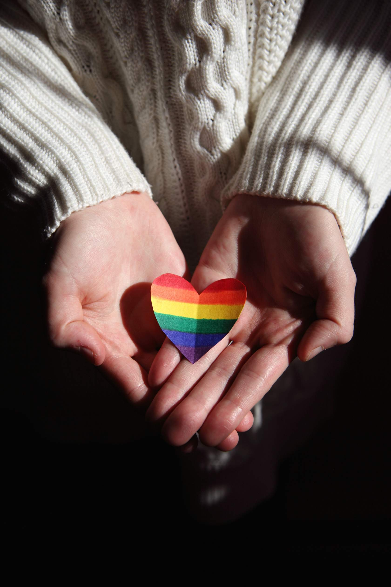
          <div class="fc-front-label">Stigma</div>
        </div>
        <div class="fc-back">
          <p class="fc-back-title">Stigma</p>
          <p class="fc-back-body">Stigma is discrimination and/or prejudice against an individual or group based on perceivable social characteristics that somehow distinguish them from other members of a group. In the context of this community, stigma is often associated with heteronormative assumptions.</p>
        </div>
      </div>
    </div>
    <p class="fc-hint">click to flip</p>
  </div>

  <div>
    <div class="fc-card" onclick="this.classList.toggle('flipped')">
      <div class="fc-inner">
        <div class="fc-front">
          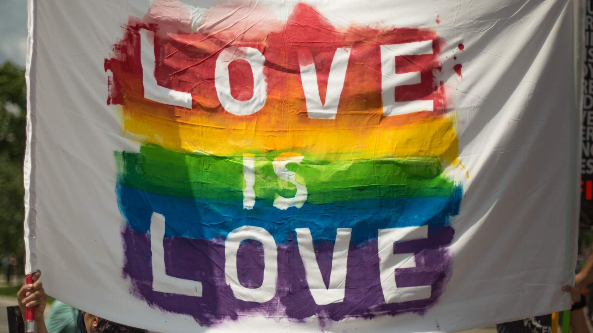
          <div class="fc-front-label">Discrimination</div>
        </div>
        <div class="fc-back">
          <p class="fc-back-title">Discrimination</p>
          <p class="fc-back-body">Discrimination occurs when someone is treated differently, or is not provided with the same opportunities as someone else due to some social or physical characteristic. In this context, members of the 2SLGBTQIA+ community may experience discrimination related to their sexual orientation or gender identity.</p>
        </div>
      </div>
    </div>
    <p class="fc-hint">click to flip</p>
  </div>

  <div>
    <div class="fc-card" onclick="this.classList.toggle('flipped')">
      <div class="fc-inner">
        <div class="fc-front">
          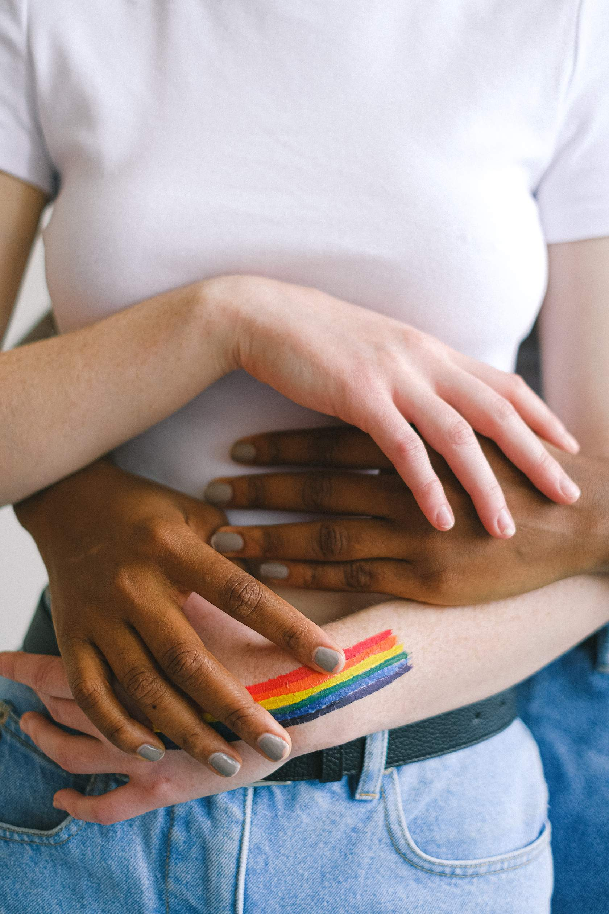
          <div class="fc-front-label">Marginalization</div>
        </div>
        <div class="fc-back">
          <p class="fc-back-title">Marginalization</p>
          <p class="fc-back-body">May include racism, sexism, poverty or other factors, alongside homophobia or transphobia that negatively impact mental health.</p>
        </div>
      </div>
    </div>
    <p class="fc-hint">click to flip</p>
  </div>

</div>
```

```{=html}
<div class="section-summary">
  <h3>2.4 Section Summary</h3>
  <p>In this section, we introduced you to the main marginalized groups and communities we will focus on throughout the remainder of this module. In the next section, we will go through each of these communities and their unique experiences with mental health in more detail.
</p>
</div>
```

------------------------------------------------------------------------

# **3. Debunking Stigma and Myths**

An intersectional lens is crucial to understanding the complex, multi-layered, and intersecting interplay between oppression and privilege.

There are common stereotypes and stigma associated with each community, which are harmful to peoples' mental health and contribute to how communities may be neglected in receiving support. Debunking myths about these communities is an important step in improving access to mental health support among marginalized communities.

## **3.1 Disability**

```{=html}
<style>
  .myth-wrap { font-family: 'Open Sans', sans-serif; border: 1px solid #dde3ec; border-radius: 12px; overflow: hidden; margin: 1.5em 0; }
  .myth-tab-bar { display: grid; grid-template-columns: 1fr 1fr 1fr; border-bottom: 1px solid #dde3ec; }
  .myth-tab { padding: 1em; text-align: center; font-size: 0.75rem; font-weight: 700; letter-spacing: 0.08em; text-transform: uppercase; color: #aaa; cursor: pointer; background: #f8f9fb; border-right: 1px solid #dde3ec; transition: all 0.2s; }
  .myth-tab:last-child { border-right: none; }
  .myth-tab.active { color: #1C2944; background: white; }
  .myth-panel { display: none; padding: 2em; }
  .myth-panel.visible { display: block; }
  .myth-statement { font-family: Georgia, serif; font-style: italic; font-size: 1.05rem; color: #1C2944; margin: 0 0 1em 0; }
  .myth-body { font-size: 0.9rem; color: #444; line-height: 1.7; margin: 0; }
</style>

<div class="myth-wrap" id="myth-wrap-disability">

  <div class="myth-tab-bar">
    <div class="myth-tab active" onclick="window.mythGoTo('disability', 0)">Myth #1</div>
    <div class="myth-tab" onclick="window.mythGoTo('disability', 1)">Myth #2</div>
    <div class="myth-tab" onclick="window.mythGoTo('disability', 2)">Myth #3</div>
  </div>

  <div class="myth-panel visible" id="myth-disability-0">
    <p class="myth-statement">"A person's disability defines who they are as an individual"</p>
    <p class="myth-body">Society often identifies individuals by their (dis)ability status and/or limitations with labels such as "the disabled" or "the epileptic". It is important to recognize that persons living with disabilities are people first.</p>
  </div>

  <div class="myth-panel" id="myth-disability-1">
    <p class="myth-statement">"People living with disabilities are dependent on others and always need help"</p>
    <p class="myth-body">It is important to recognize that disability does not mean dependency, and while people living with disabilities may require help with some things, so does anyone while performing difficult tasks. Make sure to not make such an assumption, and ask first.</p>
  </div>

  <div class="myth-panel" id="myth-disability-2">
    <p class="myth-statement">"People living with disabilities are a one-dimensional group"</p>
    <p class="myth-body">The diverse experiences of each and every person living with a disability cannot be overlooked. Society tends to assume that all PLDs have the same views, desires, and needs. However, a PLD is not representative of everyone living with a disability as they are truly reflective of the society from which they are a part of (social, economic, cultural factors).</p>
  </div>

</div>

<script>
window.mythGoTo = function(id, idx) {
  var wrap = document.getElementById('myth-wrap-' + id);
  var panels = wrap.querySelectorAll('.myth-panel');
  var tabs = wrap.querySelectorAll('.myth-tab');
  panels.forEach(function(p) { p.classList.remove('visible'); });
  tabs.forEach(function(t) { t.classList.remove('active'); });
  panels[idx].classList.add('visible');
  tabs[idx].classList.add('active');
}
</script>
```

## **3.2 BIPOC Communities**

```{=html}
<style>
  .myth-wrap { font-family: 'Open Sans', sans-serif; border: 1px solid #dde3ec; border-radius: 12px; overflow: hidden; margin: 1.5em 0; }
  .myth-tab-bar { display: grid; grid-template-columns: 1fr 1fr 1fr; border-bottom: 1px solid #dde3ec; }
  .myth-tab { padding: 1em; text-align: center; font-size: 0.75rem; font-weight: 700; letter-spacing: 0.08em; text-transform: uppercase; color: #aaa; cursor: pointer; background: #f8f9fb; border-right: 1px solid #dde3ec; transition: all 0.2s; }
  .myth-tab:last-child { border-right: none; }
  .myth-tab.active { color: #1C2944; background: white; }
  .myth-panel { display: none; padding: 2em; }
  .myth-panel.visible { display: block; }
  .myth-statement { font-family: Georgia, serif; font-style: italic; font-size: 1.05rem; color: #1C2944; margin: 0 0 1em 0; }
  .myth-body { font-size: 0.9rem; color: #444; line-height: 1.7; margin: 0; }
</style>

<div class="myth-wrap" id="myth-wrap-bipoc">

  <div class="myth-tab-bar">
    <div class="myth-tab active" onclick="window.mythGoTo('bipoc', 0)">Myth #1</div>
    <div class="myth-tab" onclick="window.mythGoTo('bipoc', 1)">Myth #2</div>
  </div>

  <div class="myth-panel visible" id="myth-bipoc-0">
    <p class="myth-statement">"Asian Americans are the 'model minority'"</p>
    <p class="myth-body">This myth has led to the ignorance regarding the diverse array of Asian cultures, and is driven by the assumption that Asian Americans are perpetual foreigners. Most importantly, it fails to recognize the racism that exists towards Asian Americans, and the fight for racial justice.  </p>
  </div>

  <div class="myth-panel" id="myth-bipoc-1">
    <p class="myth-statement">Myths regarding help-seeking among the BIPOC community</p>
    <p class="myth-body">In comparison to the 50.8% of White Canadians who reported poor or fair mental health outcomes and actively seek out mental health services, only 38.3% of Black Canadians do. This stark contrast is due to a variety of factors, of which the myths and misconceptions regarding mental health support in Black Communities is one. 
<br><br>
<ul style="font-size: 0.9rem; color: #444; line-height: 1.7; padding-left: 2em;">
  <li>“Mental health support is reserved for people experiencing severe mental illness or psychiatric issues but not those in need of a healthy mind to deal with emotions and learn how to improve the quality of their lives.”</li>
  <li>“Mental health problems can get better on their own.” </li>
  <li>“Black people who seek professional help have less faith in God.”</li>
  <li>“Ongoing mental or emotional challenges are an inherent part of the Black experience (otherwise known as “the struggle”) — therefore, mental illness isn’t a problem in Black communities.”</li>
<li>“Black people are likely to be misdiagnosed due to systemic racism.”</li>
</ul>
</p>
  </div>

</div>
```

## **3.3 Indigenous Communities**

```{=html}
<style>
  .myth-wrap { font-family: 'Open Sans', sans-serif; border: 1px solid #dde3ec; border-radius: 12px; overflow: hidden; margin: 1.5em 0; }
  .myth-tab-bar { display: grid; grid-template-columns: 1fr 1fr 1fr; border-bottom: 1px solid #dde3ec; }
  .myth-tab { padding: 1em; text-align: center; font-size: 0.75rem; font-weight: 700; letter-spacing: 0.08em; text-transform: uppercase; color: #aaa; cursor: pointer; background: #f8f9fb; border-right: 1px solid #dde3ec; transition: all 0.2s; }
  .myth-tab:last-child { border-right: none; }
  .myth-tab.active { color: #1C2944; background: white; }
  .myth-panel { display: none; padding: 2em; }
  .myth-panel.visible { display: block; }
  .myth-statement { font-family: Georgia, serif; font-style: italic; font-size: 1.05rem; color: #1C2944; margin: 0 0 1em 0; }
  .myth-body { font-size: 0.9rem; color: #444; line-height: 1.7; margin: 0; }
</style>

<div class="myth-wrap" id="myth-wrap-indig">

  <div class="myth-tab-bar">
    <div class="myth-tab active" onclick="window.mythGoTo('indig', 0)">Myth #1</div>
    <div class="myth-tab" onclick="window.mythGoTo('indig', 1)">Myth #2</div>
  </div>

  <div class="myth-panel visible" id="myth-indig-0">
    <p class="myth-statement">“It is appropriate to provide Westernized mental health practices among Indigenous peoples”</p>
    <p class="myth-body">Westernized mental health practices leaves out the aspect of spirituality, which is a crucial aspect of Indigenous cultures. Ceremony, circles and prayer are important practices and should involve the community, identity, and interdependence. Connections to Elders, along with culture, ceremony, and traditional medicines are important in supporting the wellbeing and resilience and having a positive influence on self-esteem and an Indigenous individual’s identity.   </p>
  </div>

  <div class="myth-panel" id="myth-indig-1">
    <p class="myth-statement">"Indigenous youth participate in substance use because they are bored”</p>
    <p class="myth-body">Colonialism is an important determinant of Indigenous health (both mental and physical). Forced assimilation and cultural suppression have resulted in profound social and health consequences as well as intergenerational trauma among Indigenous communities. 
<br><br>
Directly learning about the struggles that their ancestors had to face, Indigenous youth often encounter mental illness, psychological distress and/or suicidal ideation. Indigenous youth may turn to drug use as a maladaptive method of coping with poor mental health, not because they are “bored”. </p>
  </div>

</div>
```

## **3.4 2SLGBTQIA+ Communities**

```{=html}
<style>
  .myth-wrap { font-family: 'Open Sans', sans-serif; border: 1px solid #dde3ec; border-radius: 12px; overflow: hidden; margin: 1.5em 0; }
  .myth-tab-bar { display: grid; grid-template-columns: 1fr 1fr 1fr; border-bottom: 1px solid #dde3ec; }
  .myth-tab { padding: 1em; text-align: center; font-size: 0.75rem; font-weight: 700; letter-spacing: 0.08em; text-transform: uppercase; color: #aaa; cursor: pointer; background: #f8f9fb; border-right: 1px solid #dde3ec; transition: all 0.2s; }
  .myth-tab:last-child { border-right: none; }
  .myth-tab.active { color: #1C2944; background: white; }
  .myth-panel { display: none; padding: 2em; }
  .myth-panel.visible { display: block; }
  .myth-statement { font-family: Georgia, serif; font-style: italic; font-size: 1.05rem; color: #1C2944; margin: 0 0 1em 0; }
  .myth-body { font-size: 0.9rem; color: #444; line-height: 1.7; margin: 0; }
</style>

<div class="myth-wrap" id="myth-wrap-lgbt">

  <div class="myth-tab-bar">
    <div class="myth-tab active" onclick="window.mythGoTo('lgbt', 0)">Myth #1</div>
    <div class="myth-tab" onclick="window.mythGoTo('lgbt', 1)">Myth #2</div>
    <div class="myth-tab" onclick="window.mythGoTo('lgbt', 2)">Myth #3</div>
  </div>

  <div class="myth-panel visible" id="myth-lgbt-0">
    <p class="myth-statement">“Assumption of pronouns based on physical appearance is acceptable”</p>
    <p class="myth-body">We should never make assumptions about another person's identity. If you are unsure of someone’s pronouns, it is always better to offer your pronouns and ask the other person for theirs. Gender-neutral pronouns refer to pronouns that provide an identity for a person who does not identify as he/him or she/her. They/them is one of the most common gender-neutral pronouns.</p>
  </div>

  <div class="myth-panel" id="myth-lgbt-1">
    <p class="myth-statement">“Calling a transgender person by their past name is acceptable”</p>
    <p class="myth-body">This is referred to as <strong>deadnaming</strong> and occurs when someone calls a transgender person by the name they used before they transitioned. Referring to someone as their new name is crucial. Using a deadname can be invalidating, disrespectful and unsupportive of the person's transition.</p>
  </div>

  <div class="myth-panel" id="myth-lgbt-2">
    <p class="myth-statement">“Parents/friends/family have the right to know”</p>
    <p class="myth-body"><strong>Coming out</strong> refers to a process where a person first acknowledges, accepts and appreciates their sexual orientation or gender identity. When they are fully comfortable, they begin to share with others. The timing of this is at the individual's discretion, and is not anyone else's decision to make.
<br><br>
<strong>Outing</strong> refers to a process where a person exposes someone’s identity to others without permission. Outing someone can have consequences on an individual's employment, economic stability, personal safety, religion, or relationships. Strong family support is one of the most important factors in helping youth to become resilient. While parents (and other family and close friends) have an important role in their child’s life, 2SLGBTQIA+ youth always have the right to “come out” on their own terms. It is a breach of privacy legislation in some provinces to disclose one’s sexual orientation or gender identity without permission.</p>
  </div>

</div>

<script>
window.mythGoTo = function(id, idx) {
  var wrap = document.getElementById('myth-wrap-' + id);
  var panels = wrap.querySelectorAll('.myth-panel');
  var tabs = wrap.querySelectorAll('.myth-tab');
  panels.forEach(function(p) { p.classList.remove('visible'); });
  tabs.forEach(function(t) { t.classList.remove('active'); });
  panels[idx].classList.add('visible');
  tabs[idx].classList.add('active');
}
</script>
```

```{=html}
<div class="section-summary">
  <h3>3.5 Section Summary</h3>
  <p>In this section, we looked at a few myths associated with each marginalized community. Myths and stereotyping can be harmful to everyone, and can perpetuate discrimination and marginalization - intentionally or unintentionally. You can learn more about the different types and impacts of stigma in our stigma module. 
<br><br>
In the next section, we will look at each of these communities' experiences with mental health and intersections more in depth. 
</p>
</div>
```

------------------------------------------------------------------------

# **4. Mental Health and Marginalized Communities**

**Mental Health in Canada** In any given year, 1 in 5 Canadians will experience a mental health problem or illness, with the majority of people experiencing the onset of symptoms before the age of 18 ([Kessler et al. 2007](https://pmc.ncbi.nlm.nih.gov/articles/PMC1925038/)).

Mental illness affects people of all ages, education, income levels, and cultures; however, systemic inequalities such as racism, poverty, homelessness, discrimination, colonial and gender-based violence can worsen mental health and symptoms of mental illness, especially when mental health supports are difficult to access. In Canada, suicide disproportionately impacts Indigenous peoples; the rate of suicide among First Nations is three times higher than among non-Indigenous Canadians, and nine times higher among Inuit.

## **4.1 Disability**

Members of the disabled community experience mental health challenges at rate higher than the general Canadian population. The relationship between disability and mental health is made more complicated by the fact that mental illness is considered to be a disability in its own right. The following statistics are drawn from the Statistics Canada's 2017 Canadian Survey on Disability Reports ([Morris et al. 2018](https://www150.statcan.gc.ca/n1/pub/89-654-x/89-654-x2018002-eng.htm)).

```{=html}
<div style="display: flex; gap: 1.2em; margin-bottom: 1.5em; align-items: flex-start;">
  <div style="min-width: 32px; height: 32px; background: #1C2944; border-radius: 50%; display: flex; align-items: center; justify-content: center; color: white; font-weight: 700; font-size: 0.95rem;">1</div>
  <p style="margin: 0; line-height: 1.7;">In 2017, one in five (22%) of the Canadian population aged 15 years and over – or about 6.2 million individuals – lived with one or more disabilities.</p>
</div>

<div style="display: flex; gap: 1.2em; margin-bottom: 1.5em; align-items: flex-start;">
  <div style="min-width: 32px; height: 32px; background: #1C2944; border-radius: 50%; display: flex; align-items: center; justify-content: center; color: white; font-weight: 700; font-size: 0.95rem;">2</div>
  <p style="margin: 0; line-height: 1.7;">The prevalence of disability increased with age, from 13% for those aged 15 to 24 years to 47% for those aged 75 years and over.</p>
  </div>
  
  <div style="display: flex; gap: 1.2em; margin-bottom: 1.5em; align-items: flex-start;">
  <div style="min-width: 32px; height: 32px; background: #1C2944; border-radius: 50%; display: flex; align-items: center; justify-content: center; color: white; font-weight: 700; font-size: 0.95rem;">3</div>
  <p style="margin: 0; line-height: 1.7;">Among youth aged 15 - 24 years,  mental health-related disabilities were the most prevalent type of disability (8%).</p>
  </div>
```

```{=html}

<div class="crop-bottom-half">

  <div class="image-text">
    <span class="quote">Mental health-related disabilities are the most prevalent type of disability among Canadian youth, representing  60% of youth living with disabilities.</span>
  </div>
</div>
```

**Disability Status and Intersectionality**

Individuals living with a disability may also experience intersection with several other marginalized groups or factors, including socioeconomic status (influenced by education, income, employment, and expenses associated with disability), age, and sex.

```{=html}
<style>
  .myth-wrap { font-family: 'Open Sans', sans-serif; border: 1px solid #dde3ec; border-radius: 12px; overflow: hidden; margin: 1.5em 0; }
  .myth-tab-bar { display: grid; grid-template-columns: 1fr 1fr 1fr; border-bottom: 1px solid #dde3ec; }
  .myth-tab { padding: 1em; text-align: center; font-size: 0.75rem; font-weight: 700; letter-spacing: 0.08em; text-transform: uppercase; color: #aaa; cursor: pointer; background: #f8f9fb; border-right: 1px solid #dde3ec; transition: all 0.2s; }
  .myth-tab:last-child { border-right: none; }
  .myth-tab.active { color: #1C2944; background: white; }
  .myth-panel { display: none; padding: 2em; }
  .myth-panel.visible { display: block; }
  .myth-statement { font-family: Georgia, serif; font-style: italic; font-size: 1.05rem; color: #1C2944; margin: 0 0 1em 0; }
  .myth-body { font-size: 0.9rem; color: #444; line-height: 1.7; margin: 0; }
</style>

<div class="myth-wrap" id="myth-wrap-dis-inter">

  <div class="myth-tab-bar">
    <div class="myth-tab active" onclick="window.mythGoTo('dis-inter', 0)">Socioeconomic Status</div>
    <div class="myth-tab" onclick="window.mythGoTo('dis-inter', 1)">Age and Sex</div>
  </div>

  <div class="myth-panel visible" id="myth-dis-inter-0">
    <p class="myth-body">There are substantial education gaps and wage gaps between individuals living with and without a disability. Adults living with disabilities are only about half as likely to get their university-level degrees as those living without disabilities. Disabled men in the 15-to-64 age group earn $9,557 less than adult males without disabilities, while women earn $8,853 less. The unemployment rate among disabled individuals is about 2% higher than that of the general Canadian population. In one Australian study, unemployment and economic inactivity were associated with larger reductions in mental health among disabled individuals compared to non-disabled individuals (Milner et al. 2014). 
<br><br>
These factors, combined with the fact that living with disability can be very expensive (for example, a customized powered wheelchair can cost up to $25,000) means that many disabled Canadians live in poverty, placing them at increased risk for mental illness (itself a disability) (Easter Seals Canada, 2013).</p>
  </div>

  <div class="myth-panel" id="myth-dis-inter-1">
    <p class="myth-body">The prevalence of disability increases with age, and seniors are almost twice as likely to have a disability as younger Canadians (Morris et al, 2018). Disabilities are also more prevalent among women. The prevalence of disability for both women and men rose with age, but women were consistently more likely to have a disability than men across  age groups. Women are also more likely to report having "severe" disabilities compared to men. </p>
  </div>

</div>
```

```{=html}
<div style="display: flex; align-items: center; justify-content: space-between; gap: 2em; padding: 1.2em 1.5em; border-radius: 8px; background: white; border: 1px solid #eee; margin-bottom: 1em;">
  <div>
    <p style="font-weight: 700; margin: 0 0 0.3em 0; color: #1C2944;">Canadian Survey on Disability</p>
    <p style="margin: 0; font-size: 0.9rem; color: #444; line-height: 1.5;">Conducted in 2017, the Canadian Survey on Disability provides a wealth of information on the experiences of Canadians living with disability. Click to access the Statistics Canada report.</p>
  </div>
  <a href="https://www150.statcan.gc.ca/n1/daily-quotidien/181128/dq181128a-eng.htm" target="_blank" style="flex-shrink: 0; background: #1C2944; color: white; font-weight: 700; font-size: 0.8rem; letter-spacing: 0.1em; text-transform: uppercase; padding: 14px 24px; border-radius: 30px; text-decoration: none; white-space: nowrap;">Learn More</a>
</div>
```

## **4.2 BIPOC Communities**

Members of BIPOC communities experience poorer overall mental health than White Canadians, as well as higher rates of mental illness and lower rates of help-seeking. 

```{=html}
<div style="display: flex; gap: 1.2em; margin-bottom: 1.5em; align-items: flex-start;">
  <div style="min-width: 32px; height: 32px; background: #1C2944; border-radius: 50%; display: flex; align-items: center; justify-content: center; color: white; font-weight: 700; font-size: 0.95rem;">1</div>
  <p style="margin: 0; line-height: 1.7;">Between 2001 and 2014, 38.3% of Black Canadians with poor or fair self-reported mental health used mental health services compared to 50.8% of White Canadian residents <a href="https://mentalhealthcommission.ca/resource/shining-a-light-on-mental-health-in-black-communities/">(MHCC, 2021)</a>.</p>
</div>

<div style="display: flex; gap: 1.2em; margin-bottom: 1.5em; align-items: flex-start;">
  <div style="min-width: 32px; height: 32px; background: #1C2944; border-radius: 50%; display: flex; align-items: center; justify-content: center; color: white; font-weight: 700; font-size: 0.95rem;">2</div>
  <p style="margin: 0; line-height: 1.7;">During the COVID-19 pandemic, Canadians belonging to a visible minority were more likely than White Canadians to report poor mental health (27.8% vs. 22.9%) and symptoms consistent with moderate/severe generalized anxiety disorder (30.0% vs. 24.2%) <a href="https://www150.statcan.gc.ca/n1/pub/11-631-x/2020004/s3-eng.htm">(Statistics Canada, 2020)</a>.</p>
  </div>
```

```{=html}
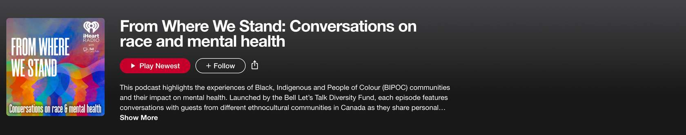
<br>
```


**BIPOC Communities and Intersectionality**

Members of the BIPOC community may also experience intersection with other marginalized groups and factors, including socioeconomic status, culture/religion, and challenges associated with finding culturally competent care.

In many cultures, mental health is perceived to be a private matter, and not something to be discussed in public ([Kam et al. 2019](https://link.springer.com/article/10.1007/s10447-018-9365-8)). Mental illness may also be falsely perceived as "weakness" ([Eisenberg et al. 2009](https://journals.sagepub.com/doi/abs/10.1177/1077558709335173?casa_token=OZTMK2VnBkoAAAAA:uXL0NUjO_5CcMTdJfY95LKHQ03Mt13lcThM1bVp9JC1UlOd3GCXhlm7k3hwnt7J-2pbJDkyq4gA)), this self-stigma presenting a major barrier to help-seeking for members of the BIPOC community, discouraging help-seeking.  The lack of representation of diverse therapists and other mental healthcare practitioners in Canada is another major barrier to help-seeking for members of the BIPOC community. The [Canadian Psychologist Association](https://cpa.ca/) (CPA) has recognized that there is a lack of representation of BIPOC mental health professionals within the psychologist profession and that there is a need to increase representation, as well as literacy about diversity.

```{=html}
<style>
  .myth-wrap { font-family: 'Open Sans', sans-serif; border: 1px solid #dde3ec; border-radius: 12px; overflow: hidden; margin: 1.5em 0; }
  .myth-tab-bar { display: grid; grid-template-columns: 1fr 1fr 1fr; border-bottom: 1px solid #dde3ec; }
  .myth-tab { padding: 1em; text-align: center; font-size: 0.75rem; font-weight: 700; letter-spacing: 0.08em; text-transform: uppercase; color: #aaa; cursor: pointer; background: #f8f9fb; border-right: 1px solid #dde3ec; transition: all 0.2s; }
  .myth-tab:last-child { border-right: none; }
  .myth-tab.active { color: #1C2944; background: white; }
  .myth-panel { display: none; padding: 2em; }
  .myth-panel.visible { display: block; }
  .myth-statement { font-family: Georgia, serif; font-style: italic; font-size: 1.05rem; color: #1C2944; margin: 0 0 1em 0; }
  .myth-body { font-size: 0.9rem; color: #444; line-height: 1.7; margin: 0; }
</style>

<div class="myth-wrap" id="myth-wrap-bipoc-inter">

  <div class="myth-tab-bar">
    <div class="myth-tab active" onclick="window.mythGoTo('bipoc-inter', 0)">Socioeconomic Status</div>
    <div class="myth-tab" onclick="window.mythGoTo('bipoc-inter', 1)">2SLBGTQIA+</div>
  </div>

  <div class="myth-panel visible" id="myth-bipoc-inter-0">
    <p class="myth-body">Inequities in access to education, income, employment, housing, and food security continue to drive inequities in health and wellbeing between members of the BIPOC community and White Canadians <a href="https://www.canada.ca/en/public-health/services/health-promotion/population-health/what-determines-health/social-determinants-inequities-black-canadians-snapshot.html">(Public Health Agency of Canada, 2020)</a>. The unemployment rate among Black Canadians is higher than that of White Canadians as well as other visible minorities <a href="https://www150.statcan.gc.ca/n1/daily-quotidien/210224/dq210224b-eng.htm">(Statistics Canada, 2021)</a>. Since many mental health services in Canada are either paid out-of-pocket, or through employment benefits, this presents a major barrier to help-seeking for BIPOC Canadians.
<br><br>
These inequities can also have an intergenerational effect, such as the inability to transmit wealth, which can predispose subsequent generations to experiencing similar struggles.</p>
  </div>

  <div class="myth-panel" id="myth-bipoc-inter-1">
    <p class="myth-body">Individuals who are members of both the BIPOC and LGBTQ2S+ communities experience being a "multiple minority" as a result of this intersection.  Individuals who are multiple minorities are often subjected to compounding systems of oppression. In this case, for example, individuals might experience homophobia, biphobia, racism, and transphobia <a href="https://www.verywellmind.com/the-intersection-of-lgbtq-and-poc-5204007">(Resnick 2022)</a>.  
<br><br>
An intersection with cultural perceptions may also exist here, placing additional pressure on individuals who find themselves at this intersection. For example, studies suggest that homosexuality is less accepted in Black cultures than in others <a href="https://pmc.ncbi.nlm.nih.gov/articles/PMC2974805/">(Glick and Golden 2010)</a>.  </p>
  </div>
  
</div>
```

------

# **Post-Module Self-Reflection**

At the start of this module, we asked you to reflect on a few questions related to your privilege and experiences with intersectionality in your own life. Having worked through this module, review those questions once again. Have your answers changed?

```{=html}
<div style="display: flex; gap: 1.2em; margin-bottom: 1.5em; align-items: flex-start;">
  <div style="min-width: 32px; height: 32px; background: #1C2944; border-radius: 50%; display: flex; align-items: center; justify-content: center; color: white; font-weight: 700; font-size: 0.95rem;">1</div>
  <p style="margin: 0; line-height: 1.7;">How do you self-identify? What communities are you a part of?</p>
</div>

<div style="display: flex; gap: 1.2em; margin-bottom: 1.5em; align-items: flex-start;">
  <div style="min-width: 32px; height: 32px; background: #1C2944; border-radius: 50%; display: flex; align-items: center; justify-content: center; color: white; font-weight: 700; font-size: 0.95rem;">2</div>
  <p style="margin: 0; line-height: 1.7;">Think of an experience where you felt conscious of your own race, class, gender, migration status, disability, sexual identity, or other aspects of your identity. </p>
  </div>
  
  <div style="display: flex; gap: 1.2em; margin-bottom: 1.5em; align-items: flex-start;">
  <div style="min-width: 32px; height: 32px; background: #1C2944; border-radius: 50%; display: flex; align-items: center; justify-content: center; color: white; font-weight: 700; font-size: 0.95rem;">3</div>
  <p style="margin: 0; line-height: 1.7;">How do your identities affect the role that you have in group settings or in personal relationships?</p>
  </div>
  
  <div style="display: flex; gap: 1.2em; margin-bottom: 1.5em; align-items: flex-start;">
  <div style="min-width: 32px; height: 32px; background: #1C2944; border-radius: 50%; display: flex; align-items: center; justify-content: center; color: white; font-weight: 700; font-size: 0.95rem;">4</div>
  <p style="margin: 0; line-height: 1.7;">Do you consider yourself to be a privileged person? Why or why not?</p>
  </div>
```

-----

# **Resources**

```{=html}
<style>
  .res-wrap { font-family: 'Open Sans', sans-serif; border: 1px solid #dde3ec; border-radius: 12px; overflow: hidden; margin: 1.5em 0; }
  .res-tab-bar { display: grid; grid-template-columns: 1fr 1fr 1fr; border-bottom: 1px solid #dde3ec; }
  .res-tab { padding: 1em; text-align: center; font-size: 0.75rem; font-weight: 700; letter-spacing: 0.08em; text-transform: uppercase; color: #aaa; cursor: pointer; background: #f8f9fb; border-right: 1px solid #dde3ec; transition: all 0.2s; }
  .res-tab:last-child { border-right: none; }
  .res-tab.active { color: #1C2944; background: white; }
  .res-panel { display: none; padding: 2em; }
  .res-panel.visible { display: block; }
  .res-card { display: flex; align-items: center; justify-content: space-between; gap: 1.5em; padding: 0.9em 1.2em; border-radius: 16px; background: white; border: 2px solid #1C2944; margin-bottom: 1em; }
  .res-card-text p { margin: 0; }
  .res-card-title { font-weight: 700; color: #1C2944; font-size: 0.9rem; margin-bottom: 0.2em !important; }
  .res-card-desc { font-size: 0.8rem; color: #444; line-height: 1.5; }
  .res-card-meta { font-size: 0.8rem; color: #444; margin-top: 0.3em !important; }
  .res-btn { flex-shrink: 0; background: #1C2944; color: white; font-weight: 700; font-size: 0.75rem; letter-spacing: 0.1em; text-transform: uppercase; padding: 10px 18px; border-radius: 30px; text-decoration: none; white-space: nowrap; }
</style>

<div class="res-wrap" id="res-wrap-main">

  <div class="res-tab-bar">
    <div class="res-tab active" onclick="window.resGoTo(0)">Indigenous Communities</div>
    <div class="res-tab" onclick="window.resGoTo(1)">LGBTQ2S+ Community</div>
    <div class="res-tab" onclick="window.resGoTo(2)">BIPOC Communities</div>
  </div>

  <div class="res-panel visible" id="res-panel-0">

    <div class="res-card">
      <div class="res-card-text">
        <p class="res-card-title">Hope For Wellness Help Line</p>
        <p class="res-card-desc">Offers immediate help to all Indigenous peoples across Canada (24 hours a day, 7 days a week). Services include: counselling over the phone or on chat in English or French. Phone counselling in Cree, Ojibway, Inuktitut available upon request.</p>
        <p class="res-card-meta"><strong>Call:</strong> 1-855-242-3310</p>
      </div>
      <a href="https://www.hopeforwellness.ca/" target="_blank" class="res-btn">Learn More</a>
    </div>

    <div class="res-card">
      <div class="res-card-text">
        <p class="res-card-title">De dwa da dehs nye>s</p>
        <p class="res-card-desc">Aboriginal Health Centre provides programming in 7 areas: Health Care, Health Promotion, Out Health Counts, Advocacy Services, Children's Programs, Mental Health Programming, and Traditional Healing to Indigenous community of Hamilton, Brantford, and Niagara.</p>
        <p class="res-card-meta"><strong>Call:</strong> Hamilton: 905-544-4320 | Brantford: 519-752-4340 | Niagara: 1-877-402-4121</p>
      </div>
      <a href="https://aboriginalhealthcentre.com/" target="_blank" class="res-btn">Learn More</a>
    </div>

    <div class="res-card">
      <div class="res-card-text">
        <p class="res-card-title">Talk For Healing</p>
        <p class="res-card-desc">Indigenous Women can get help, support and resources seven days a week, 24 hours a day, with services in 14 languages.</p>
        <p class="res-card-meta"><strong>Call:</strong> 1-855-554-4325</p>
      </div>
      <a href="https://www.talk4healing.com/" target="_blank" class="res-btn">Learn More</a>
    </div>

  </div>

  <div class="res-panel" id="res-panel-1">

    <div class="res-card">
      <div class="res-card-text">
        <p class="res-card-title">LGBTQ+ Youthline</p>
        <p class="res-card-desc">Youthline offers confidential and non-judgemental peer support through telephone, text and chat services. Get in touch with a peer support volunteer from Sunday to Friday, 4:00PM to 9:30 PM.</p>
        <p class="res-card-meta"><strong>Text:</strong> 647-694-4275</p>
      </div>
      <a href="https://www.youthline.ca/" target="_blank" class="res-btn">Learn More</a>
    </div>

    <div class="res-card">
      <div class="res-card-text">
        <p class="res-card-title">Support Our Youth</p>
        <p class="res-card-desc">Support Our Youth provides health promotion services and programming centred on supporting the health and well-being goals established by LGBTQ2S+ youth and young adults, many of whom are homeless, racialized, and newcomers to Canada. They also host Black Queer Youth (BQY), a weekly drop-in group that celebrates Black queer and trans spectrum people's experiences and accomplishments.</p>
      </div>
      <a href="https://soytoronto.com/" target="_blank" class="res-btn">Learn More</a>
    </div>

    <div class="res-card">
      <div class="res-card-text">
        <p class="res-card-title">Kid's Help Phone LGBTQ+ Space</p>
        <p class="res-card-desc">Kids Help Phone has developed a space on their website including resources about Pride, gender identity, real-life experiences, sexual orientation, discrimination and more. Info, tips, tools and stories to offer support, courage and empowerment.</p>
      </div>
      <a href="https://kidshelpphone.ca/get-info/2slgbtq-youth-allies-this-is-your-space" target="_blank" class="res-btn">Learn More</a>
    </div>

  </div>

  <div class="res-panel" id="res-panel-2">

    <div class="res-card">
      <div class="res-card-text">
        <p class="res-card-title">Black Youth Helpline</p>
        <p class="res-card-desc">Black Youth Helpline serves all youth and specifically responds to the need for a Black youth specific service, positioned and resourced to promote access to professional, culturally appropriate support for youth, families and schools. Open everyday 9am-10pm.</p>
        <p class="res-card-meta"><strong>Call:</strong> 1-833-294-8650</p>
      </div>
      <a href="https://blackyouth.ca/" target="_blank" class="res-btn">Learn More</a>
    </div>

    <div class="res-card">
      <div class="res-card-text">
        <p class="res-card-title">Healing in Colour</p>
        <p class="res-card-desc">A directory of BIPOC therapists who are committed to supporting members of the BIPOC community in all intersections. By helping to connect the community in this way, Healing in Colour aims to revitalize a legacy of healing, liberation work and resiliency practices that have been lost/taken.</p>
      </div>
      <a href="https://www.healingincolour.com/" target="_blank" class="res-btn">Learn More</a>
    </div>

    <div class="res-card">
      <div class="res-card-text">
        <p class="res-card-title">Across Boundaries</p>
        <p class="res-card-desc">Across Boundaries provides equitable, holistic mental health and addiction services for racialized communities.</p>
      </div>
      <a href="https://www.acrossboundaries.ca/" target="_blank" class="res-btn">Learn More</a>
    </div>

  </div>

</div>

<script>
window.resGoTo = function(idx) {
  var wrap = document.getElementById('res-wrap-main');
  var panels = wrap.querySelectorAll('.res-panel');
  var tabs = wrap.querySelectorAll('.res-tab');
  panels.forEach(function(p) { p.classList.remove('visible'); });
  tabs.forEach(function(t) { t.classList.remove('active'); });
  panels[idx].classList.add('visible');
  tabs[idx].classList.add('active');
}
</script>
```

------

# **Module Contributors**

```{=html}
<link rel="stylesheet" href="https://cdnjs.cloudflare.com/ajax/libs/font-awesome/6.5.0/css/all.min.css"/>

<style>
  .contrib-wrap { display: flex; gap: 1em; flex-wrap: wrap; max-width: 760px; margin: 0 auto; padding: 1rem 0; font-family: 'Open Sans', sans-serif; }
  .contrib-card { background: #f5f6f8; border-radius: 10px; padding: 1.1em 1.3em; min-width: 200px; flex: 0 1 48%; box-sizing: border-box; }
  .contrib-name { font-size: 0.85rem; font-weight: 700; color: #1C2944; margin: 0 0 0.2em 0; text-transform: uppercase; }
  .contrib-program { font-size: 0.78rem; color: black; margin: 0; line-height: 1.5; }
  .contrib-role { font-size: 0.78rem; font-style: italic; color: black; margin: 0.5em 0 0 0; }
  .contrib-links { display: flex; gap: 0.6em; }
  .contrib-link { color: #1C2944; font-size: 1.1rem; text-decoration: none; transition: opacity 0.2s; }
  .contrib-link:hover { opacity: 0.6; }
</style>

<div class="contrib-wrap">

  <div class="contrib-card">
    <p class="contrib-name">Anjena Inthiran</p>
    <p class="contrib-program">Temerty Faculty of Medicine, University of Toronto</p>
    <p class="contrib-role">Role: Content Developer</p>
  </div>
  
<div class="contrib-card">
    <p class="contrib-name">Sumin Lee</p>
    <p class="contrib-program">BHSC, Queen's University</p>
    <p class="contrib-role">Role: Content Developer</p>
  </div>
  
  <div class="contrib-card">
  <div style="display:flex; align-items:center; justify-content: space-between; flex-wrap:wrap;">
    <p class="contrib-name" style="margin:0;">Dr. Colleen Davison, PhD</p>
    <div class="contrib-links" style="margin:0;">
      <a class="contrib-link" href="https://pubmed.ncbi.nlm.nih.gov/?term=colleen+davison" title="Google Scholar" target="_blank"><i class="fa-solid fa-graduation-cap"></i></a>
      <a class="contrib-link" href="https://phs.queensu.ca/faculty-research/colleen-davison" title="University Profile" target="_blank"><i class="fa-solid fa-user"></i></a>
    </div>
  </div>
    <p class="contrib-program">Associate Professor, Queen's University<br>Associate Dean of Equity & Social Accountability</p>
    <p class="contrib-role">Role: Subject Matter Expert</p>
  </div>
  

</div>
```
